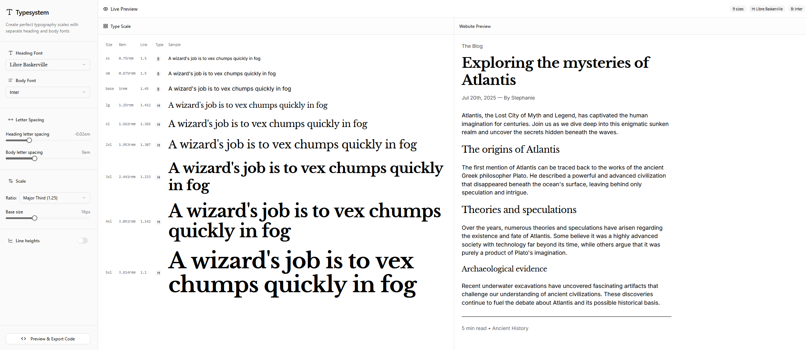

# TypeSystem


**Export perfect Typography Scales for Modern Web Projects**

---

## Project Overview

**TypeSystem** empowers designers and developers to create consistent, scalable, and beautiful typography systems for digital products. With an intuitive interface, real-time previews, and seamless export options, TypeSystem bridges the gap between design vision and production-ready code.

- **Problem Solved:** Designing harmonious, responsive typography is complex and time-consuming. TypeSystem streamlines this process, letting you experiment, visualize, and export your perfect type scale in minutes.
- **Target Audience:** UI/UX designers, web developers, design systems teams, and anyone building digital products who cares about great typography.
- **Value Proposition:** Instantly see how your font choices, weights, and sizes look in both technical tables and real website previews. Export your custom scale as Tailwind-compatible CSS for effortless integration.

---

## Key Features & Capabilities

### 🎨 Visual Type Scale Builder

- **Experiment Freely:** Adjust fonts, weights, and sizes with live feedback.
- **Technical & Real-World Preview:** See your scale in both a technical table and a realistic website mockup.
- **Instant Feedback:** Every change updates the preview and code export in real time.

### 🛠️ Tailwind-Compatible CSS Export

- **One-Click Export:** Generate ready-to-use CSS or Tailwind config code for your typography system.
- **Copy or Download:** Instantly copy code or download as a file for your project.

### 🚀 Designer-Focused Workflow

- **Intuitive UI:** Built for speed and creativity—no coding required.
- **Responsive by Default:** Preview how your typography adapts across devices.
- **Figma & Web Preview:** See your type scale in both design and live web contexts.

---

## Roadmap & Updates

### 🔜 Upcoming Features

- Community-driven presets and sharing.

---

## Getting Started

1. **Clone the repository:**
   ```bash
   git clone https://github.com/anikthink/typesystem.git
   cd typesystem
   ```
2. **Install dependencies:**
   ```bash
   npm install
   # or
   yarn install
   ```
3. **Run the development server:**
   ```bash
   npm run dev
   # or
   yarn dev
   ```
4. **Open your browser:**
   Visit [http://localhost:3000](http://localhost:3000) to start designing your typography system.
